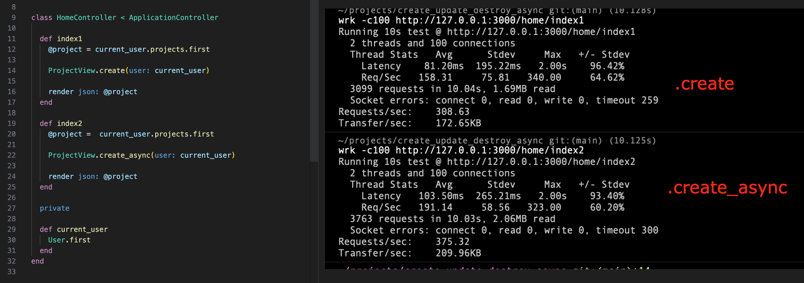

# Create/Update/Destroy + Async

[](https://www.railsjazz.com)
[](https://opensource-heroes.com/o/railsjazz)

A simple benchmark to grab your attention. Performance difference is noticeable.


A very simple solution for a very simple but annoying problem.
An example of problem that this gem solves.

```ruby
#
# code that can be improved
#
class EventsAPIController < AppController
  def show
    @event = Event.find(params[:id])

    # scroll down to see how we can improve this line
    EventView.create(user: current_user)

    render json: @event
  end
end
```

How code above can be improved (and by improved I mean faster)?
This API endpoint is responsible to return JSON info about Event.

What in this code can slowdown this API?
Probably this: `EventView.create(user: current_user)`? This is the only one write operation that we have.

Now, imagine that in our app we have background jobs. We can start a new background job to create event in async mode.
But what could be even simpler? Correct answer is to use this gem :)
With help of this gem you can rewrite your code to this:

```ruby
#
# improved version, it will work 100% faster
#
class EventsAPIController < AppController
  def show
    @event = Event.find(params[:id])

    EventView.create_async(user: current_user) # <--- here is a change

    render json: @event
  end
end
```

When we call `.create_async`, it will start a new background job and create new record in the background.

## Usage

You have methods like:

- `.create_async`
- `.save_async`
- `.update_async`
- `.destroy_async`

## Examples

```ruby

# create
User.create_async(first_name: "John", last_name: "Smith")

# update
@user.update_async(first_name: "New Name")

# save
@user.first_name = "New Name"
@user.save_async

# destroy
@user.destroy_async
```

Ideal use case - when you just need to do an atomic action that won't require any logic with object.

## Limitations:

- you need to have some background job service in your app (as far I remember Sidekiq can be started within your app)
- maybe it won't work with complex associations that are changed in the object (not tested)
- validations will happen in the background, so you cannot write code like:
  ```ruby
    if @user.save_async
      ... # this won't work as expected
    else
      ... # sorry validation happens only in the background
    end
  ```
- you cannot refer variables in your code, because they will be created in the background. Example:
  ```ruby
    @user = User.create_async(attrs)
    puts @user.full_name # this code won't work
  ```

## Installation

Add this line to your application's Gemfile:

```ruby
gem "create_update_destroy_async"
```

And then execute:
```bash
$ bundle
```

## TODO

- how to set queue where it will be executed
- verify if it works on not with more complext objects, like accept nested attributes
- options for jobs, like discard_on, priority, etc

## Benchmark

- `rails s -e production`
- `wrk -c100 http://127.0.0.1:3000/home/index1`
- stop server
- `rails s -e production`
- `wrk -c100 http://127.0.0.1:3000/home/index2`
- repeat few times to be 100% sure

## Development

You can start rails s in dummy app, and open http://localhost:3000/home/index1 and http://localhost:3000/home/index2.

In addition you need to start Sidekiq in the background.

## Contributing

You are welcome to contribute.

## License

The gem is available as open source under the terms of the [MIT License](https://opensource.org/licenses/MIT).

[](https://www.railsjazz.com/?utm_source=github&utm_medium=bottom&utm_campaign=create_update_destroy_async)
